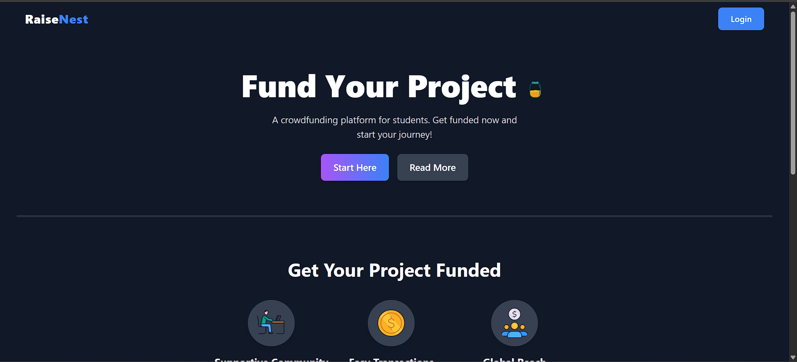

# RaiseNest - Crowdfunding Platform

RaiseNest is a modern crowdfunding platform built with React, Node.js, Next.js, and Razorpay API. It allows users to create fundraising campaigns and receive contributions securely.

## 🚀 Features

- User authentication and profile management
- Campaign creation and listing
- Secure payments using Razorpay API
- Real-time funding progress tracking
- Responsive UI/UX with modern design
- Admin dashboard for managing campaigns

## 🛠️ Tech Stack

- **Frontend:** React.js, Next.js, Tailwind CSS
- **Backend:** Node.js, Express.js
- **Database:** MongoDB
- **Payment Gateway:** Razorpay API
- **Authentication:** JWT (JSON Web Tokens)

## 📌 Installation & Setup

### 1. Clone the Repository

```sh
git clone https://github.com/your-username/raisenest.git
cd raisenest
```

### 2. Install Dependencies

```sh
npm install
```

### 3. Setup Environment Variables

Create a `.env` file in the root directory and add:

```
MONGO_URI=your_mongodb_connection_string
RAZORPAY_KEY_ID=your_razorpay_key_id
RAZORPAY_KEY_SECRET=your_razorpay_key_secret
JWT_SECRET=your_jwt_secret
NEXT_PUBLIC_API_URL=http://localhost:5000
```

### 4. Start the Development Server

#### Backend

```sh
cd server
npm run dev
```

#### Frontend

```sh
cd client
npm run dev
```

The application will run at `http://localhost:3000`


## 🎨 UI Preview


🤝 Contributing

Contributions are welcome! Please open an issue or submit a pull request.

## 📄 License

This project is licensed under the MIT License.

## 📩 Contact

For any queries, reach out at dk5506934@gmail.com

